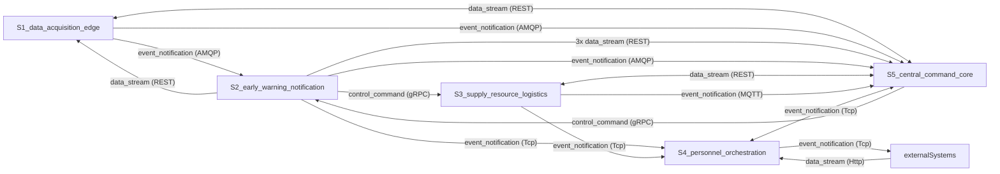
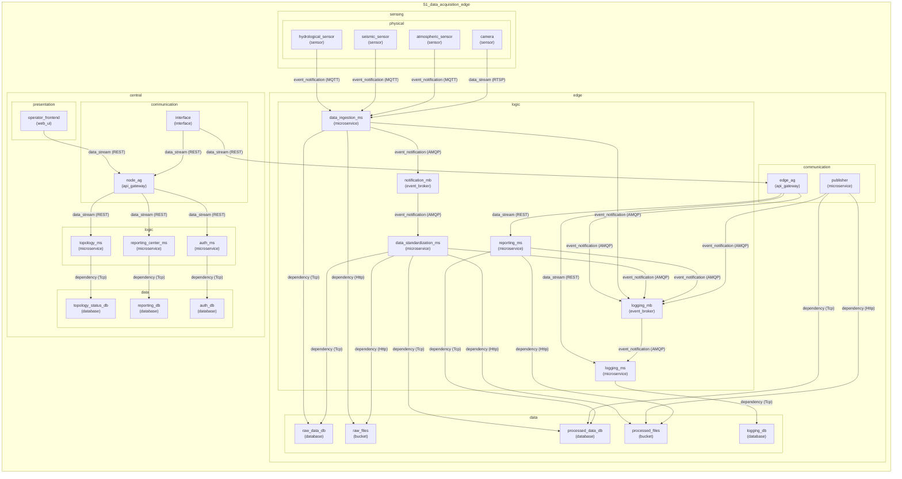
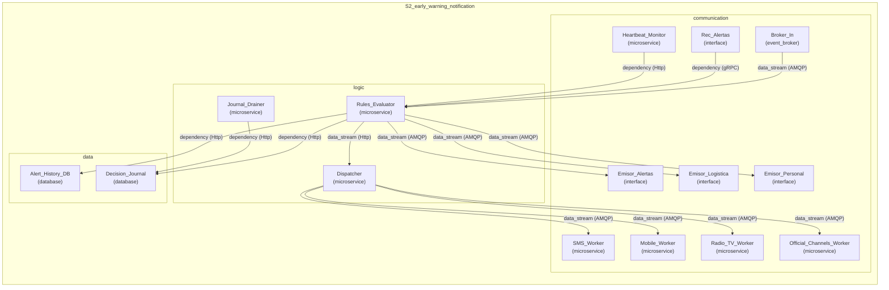
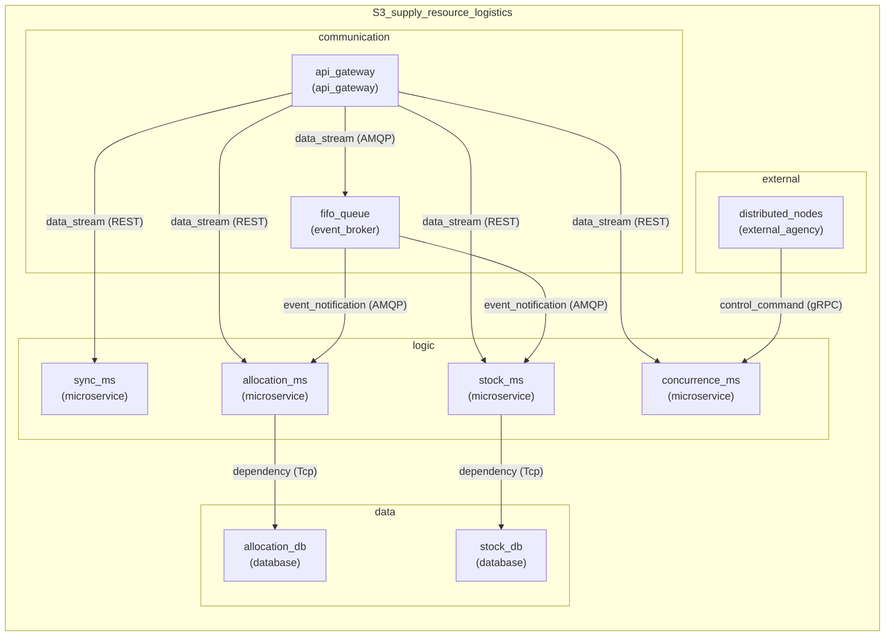
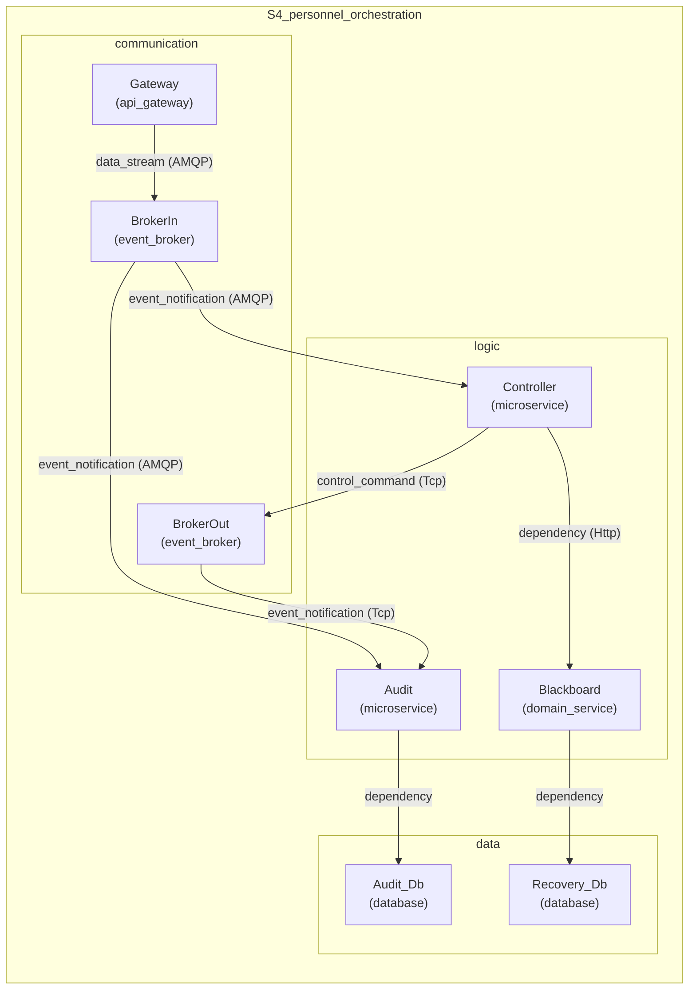
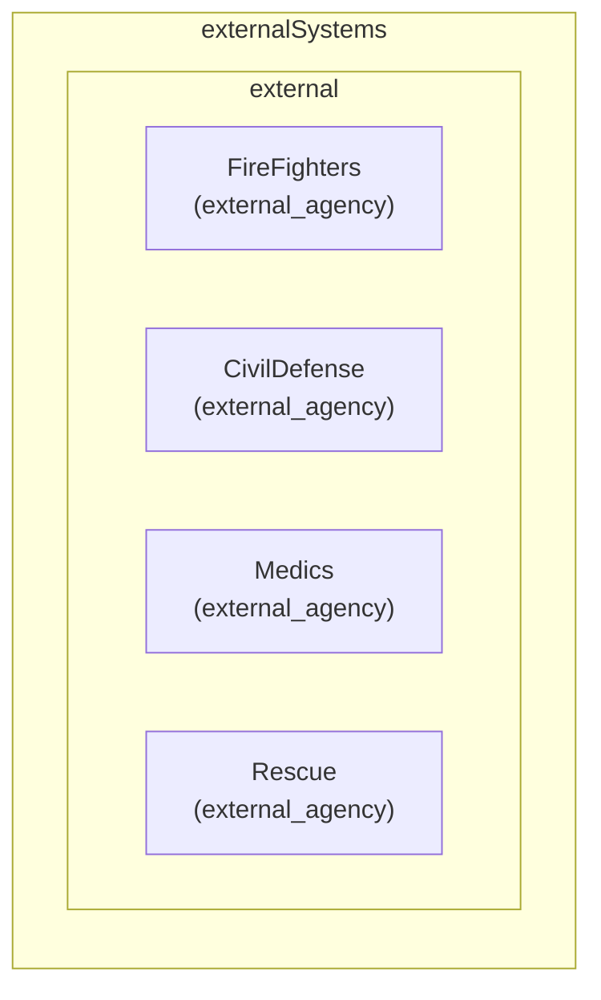
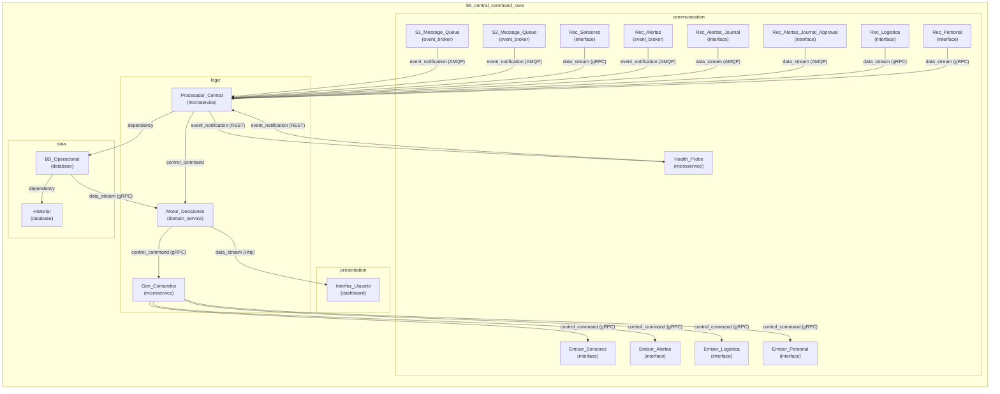

# Architecture Diagrams

## System of Systems (Global)

## Subsystem: S1_data_acquisition_edge

## Subsystem: S2_early_warning_notification

## Subsystem: S3_supply_resource_logistics

## Subsystem: S4_personnel_orchestration

## Subsystem: externalSystems

## Subsystem: S5_central_command_core

