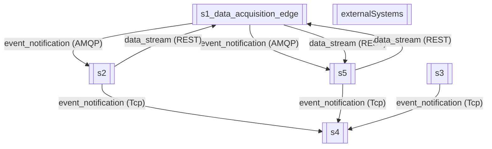
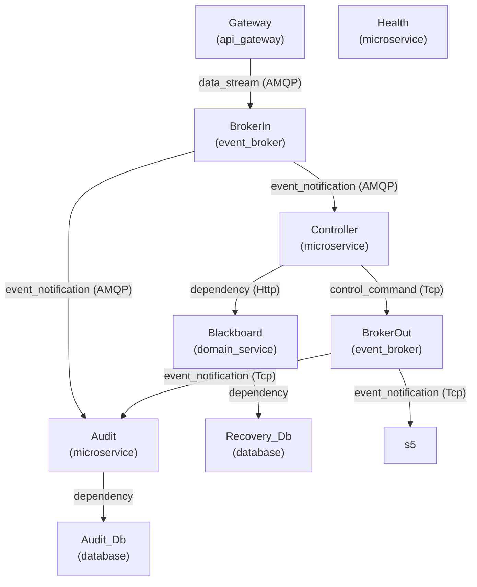
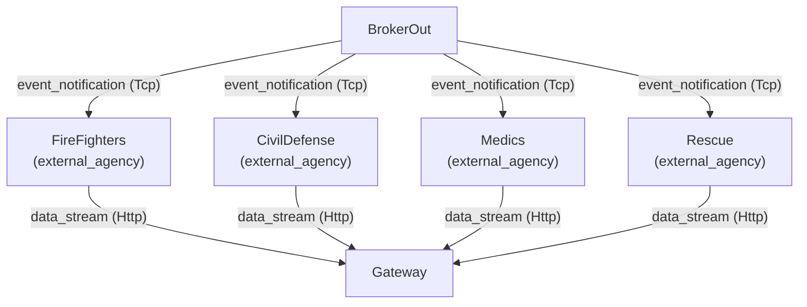

# Architecture Diagrams

## System of Systems (Global)



## Subsystem: s1_data_acquisition_edge

```mermaid
graph TD
    hydrological_sensor["hydrological_sensor<br/>(sensor)"]
    seismic_sensor["seismic_sensor<br/>(sensor)"]
    atmospheric_sensor["atmospheric_sensor<br/>(sensor)"]
    camera["camera<br/>(sensor)"]
    data_ingestion_ms["data_ingestion_ms<br/>(microservice)"]
    notification_mb["notification_mb<br/>(event_broker)"]
    data_standardization_ms["data_standardization_ms<br/>(microservice)"]
    reporting_ms["reporting_ms<br/>(microservice)"]
    logging_mb["logging_mb<br/>(event_broker)"]
    logging_ms["logging_ms<br/>(microservice)"]
    raw_data_db["raw_data_db<br/>(database)"]
    raw_files["raw_files<br/>(bucket)"]
    processed_data_db["processed_data_db<br/>(database)"]
    processed_files["processed_files<br/>(bucket)"]
    logging_db["logging_db<br/>(database)"]
    publisher["publisher<br/>(microservice)"]
    edge_ag["edge_ag<br/>(api_gateway)"]
    operator_frontend["operator_frontend<br/>(web_ui)"]
    node_ag["node_ag<br/>(api_gateway)"]
    interface["interface<br/>(interface)"]
    topology_ms["topology_ms<br/>(microservice)"]
    reporting_center_ms["reporting_center_ms<br/>(microservice)"]
    auth_ms["auth_ms<br/>(microservice)"]
    topology_status_db["topology_status_db<br/>(database)"]
    reporting_db["reporting_db<br/>(database)"]
    auth_db["auth_db<br/>(database)"]

    hydrological_sensor -- "event_notification (MQTT)" --> data_ingestion_ms
    seismic_sensor -- "event_notification (MQTT)" --> data_ingestion_ms
    atmospheric_sensor -- "event_notification (MQTT)" --> data_ingestion_ms
    camera -- "data_stream (RTSP)" --> data_ingestion_ms
    data_ingestion_ms -- "event_notification (AMQP)" --> notification_mb
    notification_mb -- "event_notification (AMQP)" --> data_standardization_ms
    edge_ag -- "data_stream (REST)" --> reporting_ms
    edge_ag -- "data_stream (REST)" --> logging_ms
    data_ingestion_ms -- "dependency (Tcp)" --> raw_data_db
    data_ingestion_ms -- "dependency (Http)" --> raw_files
    data_standardization_ms -- "dependency (Tcp)" --> raw_data_db
    data_standardization_ms -- "dependency (Http)" --> raw_files
    data_standardization_ms -- "dependency (Tcp)" --> processed_data_db
    data_standardization_ms -- "dependency (Http)" --> processed_files
    publisher -- "dependency (Tcp)" --> processed_data_db
    publisher -- "dependency (Http)" --> processed_files
    reporting_ms -- "dependency (Tcp)" --> processed_data_db
    reporting_ms -- "dependency (Http)" --> processed_files
    logging_mb -- "event_notification (AMQP)" --> logging_ms
    logging_ms -- "dependency (Tcp)" --> logging_db
    edge_ag -- "event_notification (AMQP)" --> logging_mb
    data_ingestion_ms -- "event_notification (AMQP)" --> logging_mb
    data_standardization_ms -- "event_notification (AMQP)" --> logging_mb
    reporting_ms -- "event_notification (AMQP)" --> logging_mb
    publisher -- "event_notification (AMQP)" --> logging_mb
    interface -- "data_stream (REST)" --> edge_ag
    operator_frontend -- "data_stream (REST)" --> node_ag
    interface -- "data_stream (REST)" --> node_ag
    node_ag -- "data_stream (REST)" --> topology_ms
    node_ag -- "data_stream (REST)" --> reporting_center_ms
    node_ag -- "data_stream (REST)" --> auth_ms
    topology_ms -- "dependency (Tcp)" --> topology_status_db
    reporting_center_ms -- "dependency (Tcp)" --> reporting_db
    auth_ms -- "dependency (Tcp)" --> auth_db
```



## Subsystem: s2

```mermaid
graph TD

```

## Subsystem: s3

```mermaid
graph TD

```

## Subsystem: s4



## Subsystem: externalSystems



## Subsystem: s5

```mermaid
graph TD

```
